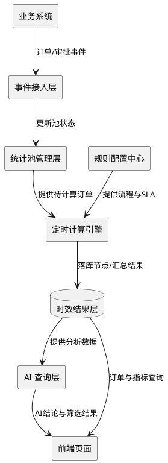
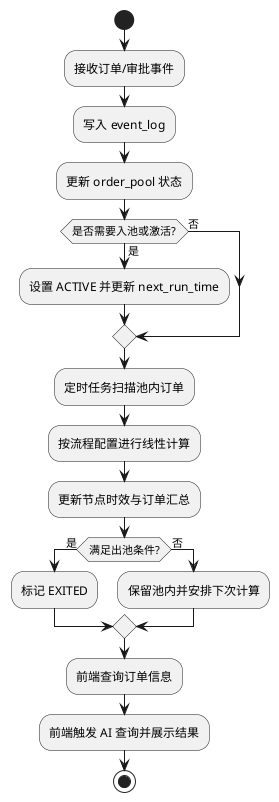

# 销售订单时效工具流程设计

## 1. 建设目标
- 以“可配置”方式管理销售订单时效统计流程，覆盖客户经理审批、财务审核、商标确认等线性审批节点。
- 通过“订单统计池 + 定时增量计算”避免全量扫表。
- 支持 AI 查询分析，前端仅负责参数采集与结果展示，核心计算在后端完成。

## 2. 总体架构
- **事件接入层**：接收订单创建、节点开始/结束、驳回、取消、关闭等事件。
- **统计池管理层**：维护待计算订单集合（入池、在池、出池、恢复）。
- **规则配置中心**：维护流程模板、节点顺序、SLA、关键节点、中断/退出条件。
- **定时计算引擎**：按批次计算池内订单时效并更新结果。
- **结果服务层**：提供节点明细、订单汇总、异常原因标签、达标率。
- **AI 查询层**：基于指标数据进行智能分析并输出结论。



## 3. 端到端流程
1. 业务系统产生订单/审批事件并写入事件日志。
2. 池管理器根据事件更新订单状态并决定是否入池或激活。
3. 定时任务按 `next_run_time` 拉取池内待处理订单。
4. 计算引擎按流程配置重建订单节点进度，执行线性时效计算。
5. 结果落库：节点时效、订单总时效、达标状态、异常原因。
6. 判断订单是否满足出池条件；满足则退出池子，否则安排下次计算。
7. 前端调用后端接口查询订单原始信息或 AI 分析结果。



## 4. 数据模型建议
- `order_pool`
  - `order_id`、`biz_type`、`pool_status`（ACTIVE/PAUSED/INTERRUPTED/EXITED）
  - `current_node`、`next_run_time`、`last_event_time`、`exit_reason`、`version`
- `process_config`
  - `process_code`、`biz_type`、`version`、`enabled`
  - 节点定义（顺序、SLA、关键节点、中断与退出规则）
- `order_node_runtime`
  - `order_id`、`node_code`、`start_time`、`end_time`、`duration`
  - `is_breached`、`breach_reason`
- `order_sla_summary`
  - `order_id`、`total_duration`、`is_order_met`、`met_ratio`、`exception_tags`
- `event_log`
  - `event_id`（幂等键）、事件类型、事件时间、业务字段快照

## 5. 订单池机制

### 5.1 概念辨析（避免与「在池更新」混淆）

| 概念 | 含义 |
|------|------|
| **入池** | 为订单建立「待时效计算」的池记录，或从 EXITED/不参与统计状态 **重新变为需要参与统计**（重激活）。 |
| **在池更新** | 订单已在 ACTIVE（等）状态中，仅更新 `next_scan_time`、`current_node` 等，**不算再次入池**。 |
| **重激活** | 曾为 EXITED 或逻辑上已退出统计，因新业务事件再次需要统计 → 按统一规则视为一次「入池意图」，执行入池或激活逻辑。 |

### 5.2 入池定义（一句话）

**入池** = 订单首次进入统计队列，或从「不参与 / 已退出」重新变为参与；仅在 ACTIVE 内刷新扫描时间与节点进度 **不属于** 入池。

### 5.3 统一入口（职责边界）

- 所有候选动作只投递 **业务事件**（或写入 `event_log`），由 **订单池管理器（Pool Manager）** 统一判定是否入池，避免多处模块各自 `INSERT order_pool`。
- 推荐链路：`业务事件 → 事件接入 → Pool Manager → 入池 / 仅更新在池字段 / 忽略`。

### 5.4 入池触发分类

**A. 必须新建池记录（首次入池）**  
满足其一即可（具体枚举可按业务配置开关）：

- 新建订单且策略要求「从创建时刻起纳入时效统计」；
- 订单首次进入需要统计的流程节点（例如首次提交审批）。

**B. 必须「入池或重激活」**

- 曾为 EXITED，后因驳回再提交、撤销后重新发起等，需要 **重新统计或延续统计**；
- 业务状态从「不参与时效统计」变为「参与」（例如 草稿 → 已提交）。

**C. 不入池，仅在池更新**

- 已在池中，仅为节点推进、附加信息变更 → 只更新 `next_scan_time`、`current_node`、`last_event_time` 等；
- 定时扫描到期后的重复计算准备 → **不属于** 入池。

### 5.5 入池副作用清单（每次判定成功必须落地）

1. `order_pool`：**插入新行**，或将已有行从 `EXITED`/不存在 → **`ACTIVE`**（重激活）。
2. 写入：`pool_status`、`current_node`（若已知）、`next_scan_time`（通常为 `now` 或 `now + 抖动`，避免惊群）。
3. 建议扩展：`entry_reason`（枚举，见下）、`entered_at`、关联 `event_id` 便于审计与幂等。

**`entry_reason` 枚举示例**：`ORDER_CREATED`、`FIRST_APPROVAL_SUBMITTED`、`REOPEN_AFTER_REJECT`、`STATUS_BECOMES_TRACKED`、`MANUAL_ENQUEUE`（人工补录）。

### 5.6 状态迁移（入池与其它状态的关系）

```
不存在池记录 --[入池事件]--> ACTIVE

EXITED --[符合重激活条件的新事件]--> ACTIVE（业务上视为再次进入统计队列）

ACTIVE --[后续业务事件]--> 仍为 ACTIVE（在池更新，不叫入池）
```

### 5.7 在池 / 出池 / 恢复（摘要）

- **在池**：存在未完成关键节点，且订单未终止；扫描任务仅处理此类订单。
- **出池**
  - 正常：全部关键节点完成；
  - 业务：订单取消/关闭/终止；
  - 风险：超长挂起或中断次数超限。
- **恢复**：中断订单在收到新事件或补齐缺失数据后可恢复为 ACTIVE（通常伴随 `next_scan_time` 提前与一次在池更新；若此前已 EXITED 则需按 **5.4-B** 判断是否重激活）。

## 6. 定时任务与计算策略
- **调度方式**：固定频率（如每 1~5 分钟）+ 分页批处理。
- **处理范围**：仅处理 `order_pool` 中 `pool_status in (ACTIVE, PAUSED, INTERRUPTED)` 且到期订单。
- **计算规则**
  - 线性约束：前一节点未完成，后一节点不可计算；
  - 计算节点时效与订单总时效；
  - 计算达标状态并打异常标签。
- **一致性保障**
  - 幂等键去重；
  - 乐观锁防并发覆盖；
  - 失败重试 + 补偿机制。

## 7. 时效口径定义
- 节点时效：`node_end_time - node_start_time`
- 订单总时效：`final_node_end_time - order_create_time`
- 节点达标：`duration <= node_sla_threshold`
- 订单达标：
  - 严格口径：关键节点全部达标；
  - 比例口径：关键节点达标率 >= 设定阈值（如 90%）。
- 支持自然时长与工作日历时长双口径。

## 8. 中断与退出机制
- **中断触发**
  - 长时间无事件；
  - 关键事件缺失（仅开始无结束等）；
  - 回退/驳回次数超阈值。
- **中断处理**
  - 标记为 `INTERRUPTED` 并记录原因；
  - 进入人工处理或自动补偿队列。
- **最终退出**
  - 满足完结/终止条件后标记 `EXITED` 并冻结统计状态。

## 9. 前后端职责边界
- **前端**
  - 选择订单类型、时间范围、输入业务问题；
  - 发起后端查询请求；
  - 展示订单原始信息与 AI 分析结果。
- **后端**
  - 负责统计池维护、定时计算、异常判定、AI 分析；
  - 返回业务化结果，不暴露内部池与计算细节。

## 10. AI 查询方案
- 输入：订单类型、时间范围、业务问题。
- 输出：
  - 结论摘要；
  - 筛选命中订单及异常原因；
  - 可选 traceId（用于审计与追踪）。
- 路由建议：
  - 简单指标问题 -> 结构化查询；
  - 复杂归因问题 -> Agent 推理链路。

## 11. 分阶段落地
- **Phase 1（MVP）**：流程配置、订单池、定时计算、基础订单查询。
- **Phase 2**：中断恢复自动化、异常标签体系、工作日历时长。
- **Phase 3**：AI 查询增强、权限审计、深度归因分析。

## 12. 验收标准
- 不全量扫表：仅池内增量处理。
- 结果准确：线性节点口径正确、可重算一致。
- 机制闭环：中断可追踪、可恢复、可退出。
- 业务可用：前端展示业务字段，AI 结果可解释。

## 13. 订单池扫描策略（增强版）

### 13.1 设计目标
- 只扫描“需要处理”的订单，避免全量扫表。
- 同一订单同一时刻只允许一个 worker 处理。
- 失败可重试、可回收，支持优先级与分片并行。
- 对扫描过程提供可观测指标，便于定位瓶颈。

### 13.2 订单池字段增强建议
- `pool_status`：`ACTIVE/PAUSED/INTERRUPTED/EXITED`
- `scan_status`：`WAITING/PROCESSING/SUCCESS/FAILED`
- `next_scan_time`：下次可扫描时间
- `priority`：优先级（加急单、临近超时单优先）
- `retry_count`、`max_retry`：重试控制
- `last_scan_time`、`last_success_time`：扫描审计
- `last_error_code`、`last_error_msg`：失败原因
- `processing_owner`、`processing_deadline`：处理占有者与超时回收
- `version`：乐观锁版本
- `shard_key`：分片键（如 `hash(order_id) % N`）

### 13.3 扫描准入条件
- `pool_status in (ACTIVE, PAUSED, INTERRUPTED)`
- `scan_status in (WAITING, FAILED, SUCCESS)`
- `next_scan_time <= now()`
- `retry_count <= max_retry`
- 命中当前 worker 分片（防止重复处理）

### 13.4 调度与分层
- 固定频率调度（如每 1 分钟）+ 批次上限（如每批 500）。
- 分层扫描建议：
  - `P0`：加急单、临近 SLA、恢复单；
  - `P1`：普通活跃单；
  - `P2`：低频复核单。
- 每轮配额可按 `P0:P1:P2 = 5:3:2` 分配。

### 13.5 抢占与并发控制
- 先 `claim` 再计算：将订单标记为 `PROCESSING`，写入 `processing_owner` 和 `processing_deadline`。
- 计算完成后回写 `SUCCESS/FAILED` 与新的 `next_scan_time`。
- 使用乐观锁（`version`）或数据库行级锁（如 `for update skip locked`）防并发覆盖。

### 13.6 重试、回收与退出
- 失败重试采用指数退避：`next_scan_time = now + min(base * 2^retry_count, max_backoff)`。
- `PROCESSING` 超时未完成视为僵尸任务，回收为 `FAILED/WAITING`。
- 超过 `max_retry` 后转 `INTERRUPTED`，进入人工处理或补偿队列。
- 达到完结/终止条件后标记 `EXITED`，不再参与扫描。

### 13.7 可观测指标
- 扫描吞吐：拉取量、claim量、成功量、失败量、回收量。
- 性能指标：平均耗时、P95 耗时、队列等待时间。
- 健康度：池状态分布、重试分布、僵尸任务数量、临近超时订单数。

## 14. 节点处理入参最小化（由订单池提供）

### 14.1 核心原则
- 每个时效处理节点不直接关心复杂上下文，只接收最小必要入参。
- 入参统一由订单池生成并下发，避免节点重复查数和口径漂移。

### 14.2 节点标准入参
- `orderType`：订单类型
- `metricField`：统计字段
- `orderId`：订单ID

### 14.3 推荐入参结构
```json
{
  "orderType": "加急订单",
  "metricField": "finance_review_duration",
  "orderId": "SO20260428021"
}
```

### 14.4 处理链路说明
1. 订单池扫描命中订单后，按流程配置生成节点任务。
2. 节点任务仅携带 `orderType + metricField + orderId`。
3. 节点处理器按 `orderId` 读取必要业务数据并计算时效。
4. 处理结果回写 `order_node_runtime` 和 `order_sla_summary`。
5. 池管理器据结果更新状态（继续扫描/中断/退出）。

### 14.5 收益
- 入参统一、接口稳定，便于节点插件化扩展。
- 降低节点耦合度，减少重复查询和无效字段传递。
- 与订单池调度天然对齐，便于做重试、补偿和审计追踪。
